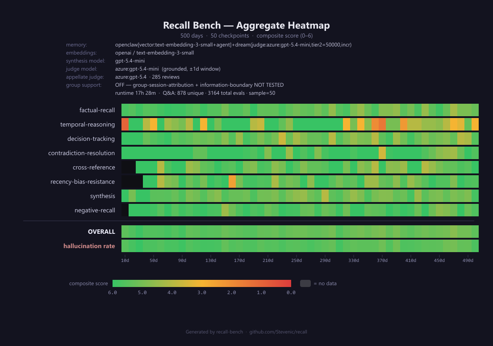

# OpenClaw + Dream vs. Executive Assistant — 500d
{: .no_toc }

This report covers a 500-day Recall Bench run of the OpenClaw agent answer-loop backed by the **Dreamweave consolidation engine** — the same `openclaw[vector:text-embedding-3-small+agent]` retrieval/answer path, but with a nightly *dream* pass that consolidates near-duplicate restatements into gists, retains their constituents as tier-2 detail, links supersede/sequence edges, and serves recall from a graph rather than a flat vector index. It is the natural comparison to the published [plain-vector OpenClaw 500d run](./openclaw-ea.html#500-day-run-ea-500d-vector): same persona (Jordan), same `qa-500d` question set, same agent loop and judges — the variable is the memory engine.

Source artifacts in-repo:
- `bench-results/openclaw/ea-500d-dream/` (this run — `result.json`, `progress.jsonl`, `failures.jsonl`, `heatmap.png`)
- `bench-results/openclaw/ea-500d-vector/` (baseline)

<details markdown="block">
<summary>Table of contents</summary>

- TOC
{:toc}
</details>

---

## TL;DR

| | Dream 500d (this run) | Plain-vector 500d (baseline) |
|---|---|---|
| **Adapter** | `openclaw[vector:text-embedding-3-small+agent] + dream(judge:gpt-5.4-mini, tier2=50000, incr)` | `openclaw[vector:text-embedding-3-small+agent]` |
| **Checkpoints** | 50 (every 10 days, 10d–500d) | 50 (every 10 days, 10d–500d) |
| **Questions evaluated (total)** | 3,164 | 3,168 |
| **Unique Q&A pairs** | 878 | 878 |
| **Overall composite (first → last quartile)** | **5.60 → 5.15** (avg 5.32) | 5.24 → 4.98 |
| **Hallucination rate (first → last quartile)** | **4.5% → 10.2%** (avg 7.7%) | 13.6% → 18.2% |
| **Hallucination peak** | **16.2%** (470d) | 27.1% (300d) |
| **Worst per-category** | `temporal-reasoning` 4.60 (4.50 → 3.90) | `temporal-reasoning` 3.89 (4.38 → 3.40) |
| **Strongest per-category** | `contradiction-resolution` 5.63 · `negative-recall` 5.57 | `factual-recall` ~5.18 |

**Headline:** adding the Dream consolidation engine to the same OpenClaw answer loop lifts the overall composite (5.32 vs 4.98 at the last quartile) and — most importantly — **roughly halves the hallucination rate** (7.7% avg vs the baseline's 13.6% floor / 18.2% last-quartile), with the peak dropping from 27% to 16%. Every scored category improves. The consolidation-and-supersede structure is doing exactly what it's meant to: collapsing the daily-restatement flood that drives the plain-vector run's confident-fabrication failure mode. **Temporal reasoning remains the weakest category** even with dreaming (4.60), and is still where future work should concentrate.

> **Fairness note.** This is an *engine-level* comparison, not a perfectly controlled A/B: the Dream run ingests the canonical `memorySave` fact stream (`tools-500d`) through the consolidation engine, while the plain-vector baseline ingests the raw `memories-500d` day files and lets its own extractor build chunks. Persona, question set, checkpoint grid, agent loop, and both judges are identical. Treat the per-category deltas as the effect of *the whole dream ingestion+recall path*, not of a single isolated knob.

---

## The run at a glance



50 checkpoints stepping every 10 days from day 10 to day 500, composite score 0–6 per category × checkpoint. The grid is almost entirely green: the overall composite holds a tight 5.1–5.6 band across the full year-and-a-half horizon with no catastrophic-forgetting cliff. The single visibly hotter row is **temporal-reasoning**, which flickers orange/red at scattered checkpoints (it is also the lowest-`questionCount` category, so individual checkpoints swing hard). Run time was **17h 28m**; 878 unique Q&A pairs, 3,164 total evaluations, sample=50 per checkpoint, appellate judge invoked 285 times.

Engine configuration: nightly consolidation runs `report → (LLM judge) → apply` over entities, aliases, salience, merges, and synthesis, with `tier2Max=50000` (the benchmark deliberately disables tier-2 archiving so nothing falls out of the retrievable set over 500 days) and incremental weave. Recall is served by the graph engine (`recall.js`) with activation reranking, hybrid dense+sparse seeding, and supersede/sequence-aware surfacing.

---

## How the score breaks down

Recall Bench scores every Q&A pair across three sub-dimensions:

```
correctness (0–3) + completeness (0–2) + hallucination (0–1) = composite (0–6)
```

The hallucination dimension is **binary** and **independent** — a question can be correct but hallucinated (a lucky guess) or wrong but not hallucinated (retrieved the wrong real memory). See the [Recall Bench overview](../recall-bench.html) for the full rubric and category definitions. As in the other EA runs, `group-session-attribution` and `information-boundary` are disabled (`groupsEnabled: false`) — the dream engine has no per-session ACL concept — so those rows are dark.

---

## Per-category breakdown

Quartile averages (weighted by per-checkpoint question count). "Δ" is the change from the first quartile of checkpoints (10d–120d) to the last (390d–500d). Baseline column is the published plain-vector 500d run for the same category.

| Category | Avg | Qs | First quartile | Last quartile | Δ | Baseline avg |
|---|---:|---:|---:|---:|---:|---:|
| `factual-recall` | 5.39 | 989 | 5.75 | 5.09 | −0.66 | 5.18 |
| `temporal-reasoning` | **4.60** | 122 | 4.50 | 3.90 | −0.60 | 3.89 |
| `decision-tracking` | 5.12 | 461 | 5.55 | 4.98 | −0.56 | 4.97 |
| `contradiction-resolution` | 5.63 | 220 | 5.87 | 5.40 | −0.46 | 5.45 |
| `cross-reference` | 5.29 | 173 | 5.24 | 5.16 | −0.08 | 4.87 |
| `recency-bias-resistance` | 5.32 | 240 | 5.26 | 5.37 | +0.11 | 4.74 |
| `synthesis` | 5.15 | 472 | 5.43 | 5.19 | −0.24 | 4.95 |
| `negative-recall` | 5.57 | 487 | 5.82 | 5.43 | −0.38 | 5.18 |
| **OVERALL** | **5.32** | 3,164 | **5.60** | **5.15** | −0.45 | 5.11 |

### What this tells us

**Every category beats the plain-vector baseline.** The largest lifts are exactly the categories the daily-restatement flood hurts most in the vector run: `recency-bias-resistance` +0.58 (4.74 → 5.32), `cross-reference` +0.42, `negative-recall` +0.39, `synthesis` +0.20. Consolidation collapses the ~86%-of-daily-writes that are restatements into gists, so a query's top-K is no longer dominated by near-duplicate chunks of the freshest topic — which is the mechanism behind the baseline's recency-bias and cross-reference weakness.

**Recency-bias-resistance is the standout structural win.** It is the *only* category that is flat-to-rising across the horizon (Δ +0.11) rather than eroding — a direct consequence of supersede-aware surfacing keeping an old, un-referenced fact retrievable instead of letting fresher chunks bury it. In the baseline this category collapses to 3.98 by the last quartile; here it holds at 5.37.

**Temporal reasoning is still the weakest category — and still the frontier.** Dreaming lifts it materially (4.60 vs 3.89 baseline; last quartile 3.90 vs 3.40), and the sequence-edge + supersede work is why. But "when did X happen relative to Y?" and "what changed between day N and day M?" questions remain the hardest: the answer often requires reconstructing a local timeline that no single retrieved node carries, and the small question count (n=122) makes individual checkpoints volatile. This is where the next lever lives.

**The graceful-decay story holds.** Overall composite drifts from 5.60 (first quartile) to 5.15 (last) — a −0.45 slope over 490 days with no cliff. Factual and negative recall stay strong throughout; the erosion is concentrated in the reasoning-heavy categories, as expected.

---

## Hallucination trajectory

The hallucination rate is the share of answers the judge scored as fabricated (at least one unsupported claim).

| | Dream 500d | Plain-vector 500d |
|---|---|---|
| First-quartile avg | **4.5%** | 13.6% |
| Last-quartile avg | **10.2%** | 18.2% |
| Median checkpoint | 7.5% | 17.6% |
| Min checkpoint | 0.0% (30d) | 0.0% (10d) |
| Max checkpoint | **16.2%** (470d) | 27.1% (300d) |

**This is the clearest win in the run.** The Dream engine's *entire* hallucination trajectory sits below the plain-vector run's *first-quartile* floor. Where the baseline crosses ~6 months and fabrication becomes the modal failure (13.6% → 18.2%, peaking at 27%), the dream run stays in a 4.5% → 10.2% band and never exceeds 16.2%. The reason is the same as the recency-bias win: with the daily-restatement flood consolidated away and supersede edges marking stale versions, the agent retrieves a smaller, cleaner, correctly-versioned candidate set, so it synthesizes fewer confident-but-wrong answers. It doesn't eliminate the confident-fabrication failure mode the plain-vector postmortem identified — it substantially reduces its frequency.

---

## Findings & operational notes

### Finding 1 — Consolidation is the hallucination lever

The plain-vector postmortem's dominant failure mode was *confident fabrication* — when wrong, the agent is almost always confidently wrong, usually by latching onto the most-frequently-restated entity. Halving the hallucination rate without touching the answer prompt confirms that a large share of that failure is **retrieval-side flooding**, not an irreducible LLM behavior: give the answer loop a de-duplicated, version-aware candidate set and it fabricates far less.

### Finding 2 — Temporal reasoning is the remaining frontier

Even with sequence edges and supersede-aware surfacing, temporal-reasoning is the weakest category (4.60) and the one most worth the next iteration. The residual misses are "reconstruct the local timeline around a cued date" questions where the answer is spread across nodes no single retrieved fact spans. This is a *representation/surfacing* problem, not a storage one — the constituent facts are retained.

### Operational note — ingest cost at `tier2Max=50000`

Running the benchmark with tier-2 archiving effectively disabled (`tier2Max=50000`, so the active set grows unbounded over 500 days) exposes an O(N²) term in the nightly consolidation's candidate-emission step: per-checkpoint ingest climbs from ~30s early to 20+ min in the back half, dominating the 17.5h wall clock. This is a **benchmark-configuration artifact, not a production characteristic** — in normal operation the tier-2 cap bounds the active set and keeps nightly cost bounded. An earlier attempt to bound cost by recency-gating the consolidation seed set was reverted after review: synthesis eligibility is *decay-triggered*, not arrival-triggered (slow, class-dependent half-lives), so any recency window silently drops slow-decay fact families — a correctness regression for a non-durable cost win. The semantics-preserving fix for the uncapped configuration is an ANN index confined to the KNN-edge step (O(N²) → O(N log N)), left as future work; the production path relies on the active-set bound instead.

---

## What we'd test next

Not a fix list — the cheap questions this run raises:

1. **Isolate the ingestion variable.** Run the dream engine against the *raw* `memories-500d` day files (its own extractor) rather than the canonical `tools-500d` stream, to separate "consolidation+recall" from "cleaner fact input" in the per-category deltas.
2. **Temporal-reasoning targeting.** The category is the frontier. A run that reconstructs a local timeline at recall time (chronological gather around the cued date/anchor) rather than returning ranked isolated facts would directly test the representation hypothesis.
3. **Does the win hold past 500d?** The overall slope is a gentle −0.45/quartile with no cliff. A 1000d run would show whether consolidation keeps the decay linear or whether an uncapped active set eventually reintroduces flooding.
4. **Cap sensitivity.** Re-run at a production-realistic `tier2Max` (e.g. 2500) to confirm the recall-quality wins survive active-set bounding and to measure the nightly-cost recovery.

Each is a single-profile change plus a re-run; adapter, corpus, and scoring stay fixed.

---

## How to reproduce

The run uses the OpenClaw harness (`bench-harnesses/openclaw/`) built against an OpenClaw checkout, with the memory backend pointed at the **Dreamweave engine** (`spqian/dreamweave`, `main`). The profile is:

- `packages/recall-bench/profiles/ea-openclaw-armB-500d-50k.yaml` (`enginePath` → the dream engine, `tier2Max=50000`, incremental weave, `dreamModel: azure:gpt-5.4-mini`)

Run and monitoring follow the standard operator playbook in [`bench-program.md`](https://github.com/Stevenic/recall/blob/main/bench-program.md). The judge/appellate models are Azure-hosted (`gpt-5.4-mini` / `gpt-5.4`), and the embedding shim serves 1536-dim `text-embedding-3-small`. The heatmap is regenerated from `result.json` with `node scripts/generate-heatmap.mjs --input <result.json>`.

Raw artifacts (`result.json`, `progress.jsonl`, `failures.jsonl`, `heatmap.png`) live under `bench-results/openclaw/ea-500d-dream/` and are the source of every number in this report. The full per-question log (`armB-questions.jsonl`, ~23 MB) is not committed for size but is regenerable from the profile.
