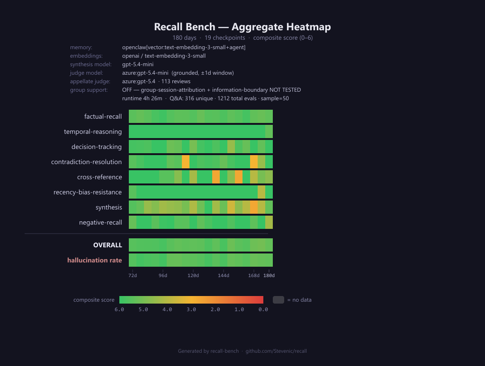
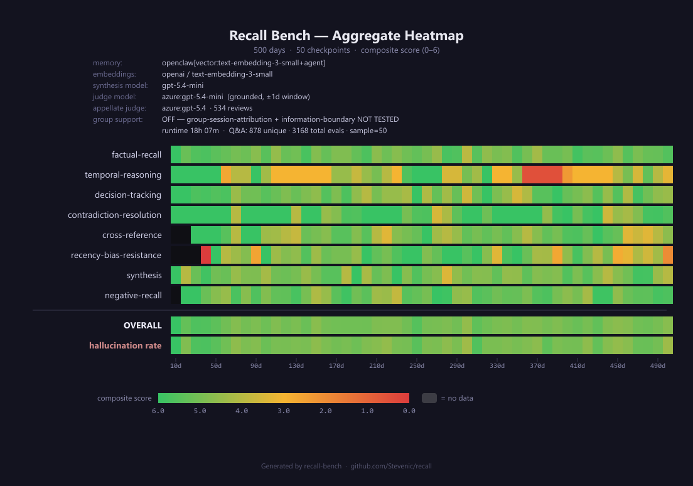

# OpenClaw vs. Executive Assistant — 180d + 500d
{: .no_toc }

A combined report on the two published OpenClaw runs against the Executive Assistant ("Jordan") persona. The 180-day run probes the medium-horizon regime; the 500-day run extends to a year and a half and shifts the dominant failure mode.

Source artifacts in-repo:
- `bench-results/openclaw/ea-180d-openclaw/`
- `bench-results/openclaw/ea-500d-vector/`

<details markdown="block">
<summary>Table of contents</summary>

- TOC
{:toc}
</details>

---

## TL;DR

| | 180d run | 500d run |
|---|---|---|
| **Adapter** | `openclaw[vector:text-embedding-3-small+agent]` | `openclaw[vector:text-embedding-3-small+agent]` |
| **Checkpoints** | 19 (every 6 days, 72d–180d) | 50 (every 10 days, 10d–500d) |
| **Questions evaluated (total)** | 1,212 | 3,168 |
| **Overall composite (first → last quartile)** | 5.58 → 5.27 (out of 6) | 5.24 → 4.98 |
| **Hallucination rate (first → last quartile)** | 5.4% → 10.9% | 13.6% → 18.2% |
| **Hallucination peak** | 13.1% | 27.1% |
| **Worst per-category trajectory** | `cross-reference` 6.00 → 4.75 | `temporal-reasoning` 4.38 → 3.40 |
| **Strongest per-category** | `factual-recall` stable ~5.49 | `factual-recall` stable ~5.28 |

**Headline:** OpenClaw holds up well on factual recall even at 1.5 years of corpus, but **temporal reasoning and recency-bias-resistance collapse** past the 6-month mark, and the **hallucination rate roughly doubles between the two runs** — driven not by honest "I don't know" responses but by confident fabrication around the wrong entity.

---

## The two runs at a glance

### 180-day run (`ea-180d-openclaw`)



19 checkpoints stepping every 6 days from day 72 to day 180. The bench evaluates the executive-assistant persona's accumulated context as the corpus grows from ~10 weeks to ~6 months. Overall composite stays in a tight 5.07–5.75 band across the window. Hallucination rate climbs from a 3–6% floor in the early checkpoints to a 9–13% range past day 150.

### 500-day run (`ea-500d-vector`)



50 checkpoints stepping every 10 days from day 10 to day 500. Same adapter configuration, same OpenAI vector embedding model, same agent answer-loop — just a longer corpus and finer checkpoint grain. Overall composite floor drops to 4.56 (at day 300); hallucination peaks hit 27.1% (day 300) and 27.0% (day 500), more than double the 180d worst case.

---

## How the score breaks down

Recall Bench scores every Q&A pair across three sub-dimensions:

```
correctness (0–3) + completeness (0–2) + hallucination (0–1) = composite (0–6)
```

The hallucination dimension is **binary** and **independent** — a question can be both correct and hallucinated (a lucky guess), or wrong but not hallucinated (the system retrieved the wrong real memory). See [Recall Bench overview](../recall-bench.html) for the full scoring rubric and category definitions.

Questions are tagged with one of eight categories. Some categories appear in the 500d run that aren't enabled in the 180d profile (and vice versa) — both runs explicitly leave `group-session-attribution` and `information-boundary` disabled, because OpenClaw's default memory has no per-session ACL concept.

---

## Per-category degradation

Quartile averages reveal where the system erodes as the corpus grows. The "Δ" column shows the change from the first quartile of checkpoints to the last.

### 180-day run

| Category | Avg score | Qs scored | First quartile | Last quartile | Δ |
|---|---:|---:|---:|---:|---:|
| `factual-recall` | 5.49 | 616 | 5.48 | 5.44 | −0.04 |
| `temporal-reasoning` | 5.92 | 24 | 6.00 | 5.60 | −0.40 |
| `decision-tracking` | 5.60 | 113 | 5.77 | 5.69 | −0.08 |
| `contradiction-resolution` | 5.42 | 74 | 5.70 | 4.62 | −1.08 |
| `cross-reference` | 5.16 | 61 | 6.00 | 4.75 | **−1.25** |
| `recency-bias-resistance` | 5.80 | 35 | 5.80 | 5.33 | −0.47 |
| `synthesis` | 4.65 | 112 | 5.17 | 4.30 | −0.87 |
| `negative-recall` | 5.69 | 177 | 5.63 | 5.49 | −0.14 |

### 500-day run

| Category | Avg score | Qs scored | First quartile | Last quartile | Δ |
|---|---:|---:|---:|---:|---:|
| `factual-recall` | 5.18 | 981 | 5.28 | 5.28 | 0.00 |
| `temporal-reasoning` | **3.89** | 122 | 4.38 | 3.40 | **−0.98** |
| `decision-tracking` | 4.97 | 456 | 5.30 | 5.02 | −0.27 |
| `contradiction-resolution` | 5.45 | 237 | 5.80 | 5.25 | −0.55 |
| `cross-reference` | 4.87 | 172 | 4.85 | 4.84 | −0.02 |
| `recency-bias-resistance` | 4.74 | 243 | 4.69 | 3.98 | −0.70 |
| `synthesis` | 4.95 | 480 | 4.98 | 4.98 | 0.00 |
| `negative-recall` | 5.18 | 477 | 5.22 | 5.24 | +0.02 |

### What this tells us

**Stable categories.** `factual-recall` and `negative-recall` are flat across both runs and both quartiles. The vector + BM25 hybrid retrieval finds atomic facts reliably even at 500 days of corpus, and OpenClaw correctly returns "no evidence" for negatives often enough to keep the score in the 5.18 range. These two categories are OpenClaw's strongest case.

**Steady erosion.** `decision-tracking`, `contradiction-resolution`, and `synthesis` degrade gradually across both runs (Δ in the 0.27–0.87 range at 180d; comparable at 500d). These categories require pulling deliberation context together across days, and the agent loop manages this — until it doesn't.

**Collapse categories.** `temporal-reasoning` and `recency-bias-resistance` are the headline weaknesses at 500 days. Temporal reasoning drops from a 5.92 average at 180d to **3.89 at 500d** — barely above a coin-flip on composite. The last-quartile mean of 3.40 (out of 6) means the system is roughly 57% accurate on questions that need it to answer "when did X happen relative to Y?" Recency-bias-resistance — asking about old memories that haven't been referenced in a long time — drops from 5.80 at 180d to **3.98 in the 500d last quartile**, a tell that OpenClaw's vector retrieval over-weights recently-written or topically-fresher chunks.

**The 180d → 500d shift in `cross-reference` is striking but inverted.** At 180d, `cross-reference` had the worst quartile delta (−1.25), but at 500d it's nearly flat (Δ 0.00) at a lower absolute level (4.87 vs. 5.16). Interpretation: with more corpus to choose from, the agent loop finds more cross-arc connections at all checkpoints, but doesn't find them well. The variance compresses around mediocre.

---

## Hallucination trajectory

The hallucination rate is the percentage of questions the appellate judge scored as fabricated — i.e., at least one claim in the answer wasn't supported by an ingested memory.

| | 180d run | 500d run |
|---|---|---|
| First-quartile avg | 5.4% | 13.6% |
| Last-quartile avg | 10.9% | 18.2% |
| Min checkpoint | 3.0% (96d) | 0.0% (10d) |
| Median checkpoint | 9.1% | 17.6% |
| Max checkpoint | 13.1% (168d) | 27.1% (300d) |

**The 500d floor is the 180d ceiling.** The first-quartile average at 500d (13.6%) is just above the 180d worst checkpoint (13.1%). That's the signal: as the corpus crosses ~6 months, the hallucination rate stops being a rare-event problem and becomes the modal failure mode.

Day 300 in the 500d run is the worst checkpoint at 27.1%, and day 500 is nearly identical at 27.0%. The trajectory is volatile but trending up: the regression slope across the 50 checkpoints is positive and meaningful.

---

## Issues uncovered

The remainder of this report digs into specific failure patterns surfaced by the appellate-reviewed failure logs (`failures.jsonl`). The 180d log has 113 reviewed failures; the 500d log has 534. The patterns below appear in both, generally with higher density at 500d.

### Issue 1 — Confident fabrication is the dominant failure mode

In **89% of 500d reviewed failures and 91% of 180d reviewed failures**, the appellate judge scored hallucination = 0 (fabricated). Only **3.7% of 500d failures and 3.5% of 180d failures** were "honest refusals" — answers containing phrases like *"I checked memory but didn't find…"* or *"I don't have enough information."*

In other words: **when OpenClaw is wrong, it's almost always confidently wrong, not silently wrong.** This is the inverse of what you'd want for an executive assistant.

The synthesis-side system prompt (`bench-harnesses/openclaw/src/synthesis.ts`) attempts to address this — it explicitly says *"If the excerpts do not contain a confident answer, say plainly that you checked the memory and did not find it — never invent details."* The agent-loop prompt (`agent-loop.ts:46`) echoes that guidance. Despite this, the model rarely takes the refusal path; it almost always synthesizes an answer from whatever it retrieved, even when the retrieval is off-target.

This is a known LLM behavior, not a bug in OpenClaw's retrieval — but the harness's measurement reveals how much it dominates the failure surface at 500 days of corpus.

### Issue 2 — Entity contamination: "Jamie" answers questions about everyone

In **43% of 500d failures and 39% of 180d failures**, the system answer mentions "Jamie" — the principal Jordan supports — when the question is about Jordan or about another cast member. Example from the 500d log:

> **Q:** "How did Jordan's personal communication-style heuristic evolve across days 8–14?"
>
> **A:** "I checked memory, but I couldn't find a clean day-by-day set for **days 8–14** specifically under **Jordan**. The closest matching record is for **Jamie**, and it shows the heuristic evolving like this: …"

The system then proceeds to fabricate a Jamie-flavored answer with day-by-day fake citations.

What's happening: Jamie is the most-mentioned entity in the corpus by a wide margin (he's the principal), so vector search and BM25 both surface Jamie-tagged chunks for many queries. The agent loop then synthesizes around what it retrieved instead of refusing — even when it explicitly acknowledges the retrieval doesn't match.

This is a **retrieval-side calibration problem** (the most-frequent entity dominates ranking) **plus an agent-side refusal problem** (the agent doesn't abort when retrieval doesn't match the question's subject). Both layers contribute; fixing either alone would reduce the rate.

### Issue 3 — Easy questions failing repeatedly

The 500d failure log contains questions that fail across **8 or 9 checkpoints in a row**, including several tagged `difficulty: easy`:

| Question ID | Failures | Category | Sample question |
|---|---:|---|---|
| `q172` | 9 | temporal-reasoning | "What changed between the weekend principal-session handling…" |
| `q062` | 8 | factual-recall (easy) | "What was the stated authorization baseline Jordan maintained for Jamie's inbox…" |
| `q091` | 8 | factual-recall (easy) | "What file path was repeatedly used for the Caldwell remediation draft…" |
| `q201` | 8 | decision-tracking | "What did Rashid Patel warn about in the executive-team ERP checkpoint…" |
| `q313` | 8 | temporal-reasoning | "What changed between day 176 and day 181 regarding the Caldwell Group reschedule…" |
| `q378` | 8 | temporal-reasoning (easy) | "On the weekend quiet days, did Jordan send Jamie a 6:30 AM morning briefing?" |
| `q009` | 7 | factual-recall (easy) | "What school-return date did Jordan protect for Riley and Tess?" |

The temporal-reasoning repeats are unsurprising given the category-level data. The pattern that matters: **easy factual-recall questions failing 7–8 times in a row** — those are the questions the bench thinks any working memory system should answer trivially, and OpenClaw misses them at every checkpoint it's asked. These make excellent canary questions for future regression tracking.

### Issue 4 — `force: true` on sync is required, despite its cost

An earlier 500d run, `ea-500d-noforce-v2` (since pruned), explored running OpenClaw's `sync()` **without** `force: true` to reduce per-checkpoint wall-clock time (full reindex at day 500 takes ~25 minutes). The result was a 2.3× increase in appellate-reviewed failures (1,233 vs. 534) and noticeable quality regression across every category.

The conclusion baked into the current adapter (`bench-harnesses/openclaw/src/adapter.ts:160-170`) is a 750ms sleep before each `sync()` call to let chokidar's file watcher pick up newly-written day files, followed by a non-force sync. The comment explains the trade:

> The bench writes files and calls sync() back-to-back, so chokidar hasn't fired yet — we must wait briefly for the watcher to observe the new files and mark them dirty. 750ms is a generous margin over chokidar's default stability threshold (~100ms) and still cheap (~750ms per checkpoint vs. the ~25-min full-rebuild cost when force: true is passed at day 500).

The 500d-vector run uses this 750ms-then-non-force pattern in its incremental ingest model — it ingests once and incrementally checkpoints, so the full-rebuild cost isn't paid per checkpoint. **The "noforce" tag refers to a different experiment that disabled `force: true` even at the initial bulk-sync step**, which is what regressed quality. Lesson: incremental sync is fine, but skipping `force: true` on the initial materialization is not.

### Issue 5 — Information-boundary categories are dark

Both runs explicitly leave `groupsEnabled: false` in the profile (`packages/recall-bench/profiles/ea-180d-openclaw.yaml` and `ea-500d-vector.yaml`). The `group-session-attribution` and `information-boundary` categories therefore have **zero questions scored** at any checkpoint, and any session-isolation behavior of OpenClaw's default backend is untested by these runs.

This is intentional: OpenClaw's built-in memory has no per-session ACL concept (see [comparison](../comparison-recall-vs-openclaw.html#7-context-loading--integration)), so scoring those categories would just confirm "all content is visible to all queries." Future work would either build an isolated-workspace variant of the adapter or flip the groups flag and report the expected zero scores as documentation.

---

## What we'd test next

This isn't a fix list — it's the questions the failure data raises that another run could answer cheaply:

1. **Does refusal prompting actually move the needle?** Re-run with a stricter synthesis prompt that requires the model to refuse when retrieval doesn't include the question's subject by name. Watch the entity-contamination rate.
2. **Does retrieval over-weighting drop with an entity filter?** Add a query-time filter that re-ranks results to penalize chunks whose top entity differs from the question's subject. Same persona, same corpus, same scoring — should be a clean A/B.
3. **Does the temporal-reasoning collapse track corpus age or absolute corpus size?** The 500d run shows the collapse appearing past day ~150. A 1000d run on the same persona would tell us whether the regression continues linearly or plateaus.
4. **What does the OpenClaw dreaming pass do to these numbers?** Both runs use OpenClaw's default backend without dreaming. A run with dreaming enabled would surface whether the signal-based MEMORY.md promotion model helps with recency-bias-resistance.

Each of these is a single-profile change plus a re-run; the adapter and corpus stay fixed.

---

## How to reproduce

Both runs use the same OpenClaw harness — `bench-harnesses/openclaw/` in this repo — built inside an OpenClaw checkout per [`harness-program.md`](https://github.com/Stevenic/recall/blob/main/bench-harnesses/openclaw/harness-program.md). The two profiles are:

- `packages/recall-bench/profiles/ea-180d-openclaw.yaml`
- `packages/recall-bench/profiles/ea-500d-vector.yaml`

Both use Azure-hosted models for the agent answer-loop, primary judge, and appellate judge. The full operator's playbook for running, monitoring, and resuming benchmarks is in [`bench-program.md`](https://github.com/Stevenic/recall/blob/main/bench-program.md).

Raw artifacts for each run (`result.json`, `progress.jsonl`, `failures.jsonl`, `heatmap.png`) live under `bench-results/openclaw/<run-id>/` in the repository and are the source of every number in this report.
