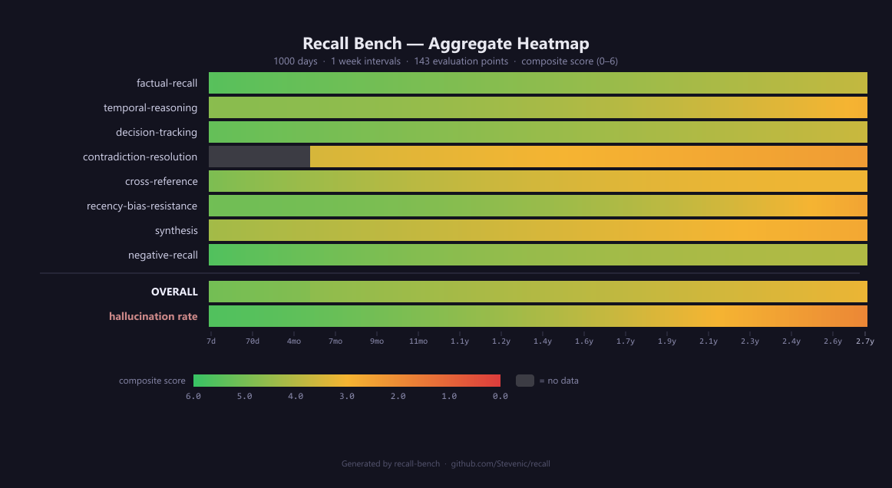

# Recall Bench

Recall Bench is a benchmark harness for evaluating agent memory systems. It measures how well a memory system can **ingest**, **organize**, and **retrieve** information over long time horizons — up to 1,000 days of synthetic daily logs per persona.

## Why Recall Bench?

Most memory system evaluations test retrieval over small corpora or short time spans. Real-world agents accumulate months or years of context. Recall Bench fills that gap by simulating realistic, long-horizon memory workloads across diverse professional domains and measuring performance degradation as the corpus grows.

## How It Works

Recall Bench follows a three-phase evaluation loop:

```
┌──────────────────────────────────────────────────────────────────┐
│                     Benchmark Lifecycle                          │
│                                                                  │
│  For each (persona × time-range):                                │
│                                                                  │
│    1. SETUP        → adapter.setup()                             │
│    2. INGEST       → adapter.ingestDay(1..N)  [chronological]    │
│    3. FINALIZE     → adapter.finalizeIngestion()                 │
│    4. QUERY        → adapter.query(question)  [for each Q&A]    │
│    5. SCORE        → judge.score(question, ref, answer)          │
│    6. TEARDOWN     → adapter.teardown()                          │
│                                                                  │
│  Each time-range gets a FRESH lifecycle — no state leaks.        │
└──────────────────────────────────────────────────────────────────┘
```

**Phase 1 — Ingestion.** Daily memory logs (markdown) are fed to the system under test in chronological order. The system can index, embed, summarize, or store them however it likes.

**Phase 2 — Querying.** The harness poses natural-language questions grounded in specific days. Questions are filtered per time-range so the system is only asked about information it has actually seen.

**Phase 3 — Scoring.** A judge model compares each answer against a reference answer and scores it on three dimensions:

| Dimension | Scale | What it measures |
|---|---|---|
| **Correctness** | 0–3 | Does the answer contain the right facts? |
| **Completeness** | 0–2 | Does it include all relevant details? |
| **Hallucination** | 0–1 | Is it grounded in actual memories? (1 = yes) |

**Composite score** = correctness + completeness + hallucination → max **6.0** per question.

## Evaluation Dimensions

Scores are broken down across **8 categories** that probe different memory capabilities:

| Category | What it tests |
|---|---|
| `factual-recall` | Retrieving specific facts from past days |
| `temporal-reasoning` | Understanding when events happened and their order |
| `decision-tracking` | Remembering decisions and their rationale |
| `contradiction-resolution` | Detecting when later information supersedes earlier beliefs |
| `cross-reference` | Connecting information across unrelated arcs |
| `recency-bias-resistance` | Not favoring recent memories over equally relevant older ones |
| `synthesis` | Combining information from multiple days into a coherent answer |
| `negative-recall` | Correctly reporting that something did NOT happen |

## Evaluation Periods

Performance is measured at regular intervals across the corpus to reveal how the system degrades as memory grows. The evaluation period is configurable — the default is **1 week** (7 days).

For a 1,000-day corpus at weekly intervals, this produces **143 evaluation points**, each representing a fresh ingest-and-query cycle up to that day. The heatmap renders each point as a colored cell, creating a continuous gradient that exposes degradation patterns more precisely than a handful of fixed ranges.

| Interval | Evaluation Points (1000d) | Best for |
|---|---|---|
| `1` (daily) | 1000 | Fine-grained analysis (slow) |
| `7` (weekly, default) | 143 | Standard benchmark runs |
| `14` (biweekly) | 72 | Faster iteration |
| `30` (monthly) | 34 | Quick smoke tests |

Each evaluation point gets a **completely fresh** adapter lifecycle. Q&A pairs are filtered so only questions whose `relevant_days` all fall within the cutoff day are included.

## The Persona System

Recall Bench uses **personas** — synthetic identities with realistic professional backgrounds spanning 1,000 days of activity. Each persona has:

- **Identity** (`persona.yaml`) — name, role, domain, company, communication style
- **Story arcs** (`arcs.yaml`) — overlapping narrative threads (projects, incidents, decisions, learning, relationships, corrections) that drive what happens each day
- **Daily logs** (`memories/day-NNNN.md`) — 1,000 markdown files, one per day
- **Q&A pairs** (`qa/questions.yaml`) — evaluation questions with reference answers, categories, difficulty levels, and relevant day numbers

### Shipped Personas

The benchmark ships with 5 cross-domain personas to ensure the evaluation isn't biased toward any single profession:

| Persona | Role | Domain |
|---|---|---|
| `backend-eng-saas` | Senior Backend Engineer | B2B SaaS platform |
| `er-physician` | Emergency Physician | Urban trauma center |
| `litigation-attorney` | Litigation Attorney | Mid-size law firm |
| `research-scientist` | Research Scientist | University biology lab |
| `financial-advisor` | Financial Advisor | Wealth management firm |

### Story Arcs

Arcs create realistic complexity:

- **4 max concurrent arcs** at any time — avoids overwhelming any single day
- **Arc types:** projects (long-running), incidents (short bursts), decisions (medium-length deliberation), learning (skill acquisition), relationships (interpersonal threads), corrections (belief revisions)
- **Correction arcs** are especially important — they test whether the system can track that a previously held belief was later corrected
- **Quiet periods** (vacations, breaks) are intentionally included to test behavior with temporal gaps

## Dataset Generation Pipeline

Datasets are generated using a **two-pass LLM pipeline**:

```
┌─────────────────────────────────────────────────────────────────┐
│  Step 1: create-persona                                         │
│  Prompt → persona.yaml + arcs.yaml                              │
├─────────────────────────────────────────────────────────────────┤
│  Step 2: generate  (Pass 1)                                     │
│  Process arcs in order → generate day-by-day logs               │
│  • Arc-driven: each arc selects its active days                 │
│  • Merge: if two arcs overlap on the same day, content merges   │
│  • Context: sliding window of recent days + arc summaries       │
│  • Density hints: quiet / normal / busy / dense                 │
├─────────────────────────────────────────────────────────────────┤
│  Step 2b: Gap filling                                           │
│  Fill weeks with < 5 active days with routine filler            │
├─────────────────────────────────────────────────────────────────┤
│  Step 3: generate-conversations  (Pass 2, optional)             │
│  Convert daily logs → user/assistant conversation turns         │
├─────────────────────────────────────────────────────────────────┤
│  Step 4: Create Q&A pairs  (manual or LLM-assisted)             │
│  questions.yaml with reference answers + metadata               │
└─────────────────────────────────────────────────────────────────┘
```

**Pass 1** separates "what happened" from how it was communicated. **Pass 2** optionally reconstructs the conversations that would have produced those logs.

## Connecting Your Memory System

Any system that can ingest markdown and answer questions can participate. Two integration paths:

### TypeScript Adapter

```typescript
import type { MemorySystemAdapter, DayMetadata } from '@recall/bench';

const adapter: MemorySystemAdapter = {
  name: 'My Memory System',
  async setup() { /* clean state */ },
  async ingestDay(day: number, content: string, metadata: DayMetadata) { /* store */ },
  async finalizeIngestion() { /* build indexes */ },
  async query(question: string): Promise<string> { return answer; },
  async teardown() { /* cleanup */ },
};
export default adapter;
```

### gRPC Adapter (any language)

Implement the `MemoryBenchService` proto and point the harness at it:

```bash
npx recall-bench run --adapter grpc://127.0.0.1:50052 --data ./personas
```

The gRPC interface maps 1:1 to the TypeScript adapter. This lets you write adapters in Python, Go, Rust, Java, C#, or anything with gRPC support.

## Output: The Heatmap

The primary output is a **category × time-range heatmap** showing mean composite scores. This is the key artifact for understanding a memory system's strengths and weaknesses.

### Example Heatmap Output

```
═══════════════════════════════════════════════════════════════════════════════
  AGGREGATE HEATMAP — Recall System v0.4 (5 personas, 1-week intervals)
═══════════════════════════════════════════════════════════════════════════════
                             7d   14d   21d   28d  ...   980d  987d  994d 1000d
───────────────────────────────────────────────────────────────────────────────
  factual-recall            5.5   5.5   5.4   5.4  ...   3.9   3.8   3.8   3.8
  temporal-reasoning        4.7   4.7   4.7   4.6  ...   3.0   2.9   2.9   2.9
  decision-tracking         5.3   5.3   5.2   5.2  ...   3.8   3.7   3.7   3.7
  contradiction-resolution   --    --    --    --   ...   2.5   2.4   2.4   2.4
  cross-reference           4.9   4.8   4.8   4.7  ...   3.2   3.1   3.1   3.1
  recency-bias-resistance   5.1   5.1   5.0   5.0  ...   2.7   2.7   2.6   2.6
  synthesis                 4.3   4.3   4.2   4.2  ...   2.8   2.7   2.7   2.7
  negative-recall           5.6   5.6   5.5   5.5  ...   4.1   4.1   4.1   4.1
───────────────────────────────────────────────────────────────────────────────
  OVERALL                   5.06  5.04  5.01  4.99 ...   3.25  3.19  3.17  3.16
═══════════════════════════════════════════════════════════════════════════════
  Hallucination rate:       1.0%  1.1%  1.1%  1.2% ...   9.7%  9.9% 10.1% 10.3%
═══════════════════════════════════════════════════════════════════════════════

  143 evaluation points (... indicates ~135 omitted columns)
```

### Reading the Heatmap

**Columns** represent evaluation points at each interval. Reading left to right shows how performance degrades as the corpus grows. A system with good long-term recall will show a gentle color transition; a system that relies heavily on recency will show a sharp green-to-red shift.

**Rows** represent evaluation categories. Each cell's color reflects the mean composite score (0.0–6.0) across all personas and eligible questions for that category at that evaluation point. Green = strong performance, amber = moderate, red = poor.

Key patterns to look for:

- **Sharp color transition** in `recency-bias-resistance` → system over-weights recent memories
- **Gray cells** in `contradiction-resolution` at early periods → correction arcs haven't started yet (by design — corrections take time to develop)
- **Consistently warm colors** across `synthesis` → system struggles to combine information from multiple memories
- **Persistent green** in `negative-recall` → system correctly avoids fabricating answers
- **Hallucination rate shifting to warm colors** → system fills gaps with fabricated content as the corpus grows

### Visual Heatmap (Color-Coded)

When rendered visually, the heatmap uses a green → amber → red color scale to make performance patterns immediately obvious:



The characteristic "cooling gradient" from left to right is expected — all memory systems degrade with scale. What matters is *how steep* the gradient is and *which categories* degrade fastest. Gray cells (`--`) indicate insufficient data at that time range.

> **Regenerate the image:** `node scripts/generate-heatmap.mjs [--interval 7] [--days 1000] [--output path.png]` (requires `canvas` dev dependency).

## CLI Reference

### Running a Benchmark

```bash
npx recall-bench run \
  --adapter grpc://127.0.0.1:50052 \
  --data ./personas \
  --judge ./my-judge.js \
  --personas backend-eng-saas er-physician \
  --ranges 30d,full \
  --json
```

| Flag | Default | Description |
|---|---|---|
| `--adapter <url\|path>` | required | gRPC URL or JS adapter module |
| `--data <dir>` | required | Dataset directory |
| `--judge <path>` | stub (zeros) | JS judge module |
| `--personas <ids...>` | all | Subset of personas to run |
| `--interval <days>` | 7 | Evaluation period in days |
| `--ranges <ranges...>` | all | Time ranges to evaluate (legacy) |
| `--seed <n>` | 42 | Shuffle seed for question order |
| `--timeout <ms>` | 30000 | Per-question timeout |
| `--grpc-timeout <ms>` | 120000 | Per-RPC timeout |
| `--parallelism <n>` | 1 | Concurrent queries |
| `--json` | false | Full JSON output |
| `--heatmap` | false | Heatmap grid only (JSON) |

### Generating Datasets

```bash
# Step 1: Create persona + arcs
npx recall-bench create-persona \
  --prompt "A backend engineer at a B2B SaaS company" \
  --model claude --out ./dataset/my-persona

# Step 2: Generate 1,000 days
npx recall-bench generate \
  --persona ./dataset/my-persona --model claude

# Step 3: (Optional) Generate conversations
npx recall-bench generate-conversations \
  --persona ./dataset/my-persona --model claude --format markdown
```

### Utility Commands

```bash
# List available personas
npx recall-bench list --data ./personas

# Show time-range definitions
npx recall-bench ranges
```

## Architecture

```
┌───────────────────────────────────────────────────────────────┐
│                       recall-bench                            │
├───────────────┬──────────────────┬────────────────────────────┤
│   CLI Layer   │  Harness Engine  │   Generation Pipeline      │
│  (commander)  │  (orchestration) │  (LLM-driven)              │
├───────────────┼──────────────────┼────────────────────────────┤
│ cli.ts        │ harness.ts       │ persona-creator.ts         │
│               │ types.ts         │ generator.ts               │
│               │ report.ts        │ conversation-generator.ts  │
│               │ dataset.ts       │ generator-types.ts         │
├───────────────┴──────────────────┴────────────────────────────┤
│                     Adapter Layer                             │
│  ┌─────────────────────┐    ┌──────────────────────────────┐  │
│  │  JS Module Adapter  │    │  gRPC Adapter (any language)  │ │
│  │  (direct import)    │    │  (proto/memory_bench_service) │ │
│  └─────────────────────┘    └──────────────────────────────┘  │
└───────────────────────────────────────────────────────────────┘
```

## Programmatic API

All functionality is available as a library:

```typescript
import {
  BenchmarkHarness,
  formatTextReport,
  formatJsonReport,
  toHeatmapGrid,
  loadPersona,
  filterQAByRange,
  listPersonas,
  DayGenerator,
  PersonaCreator,
  GrpcMemoryAdapter,
} from '@recall/bench';
```
